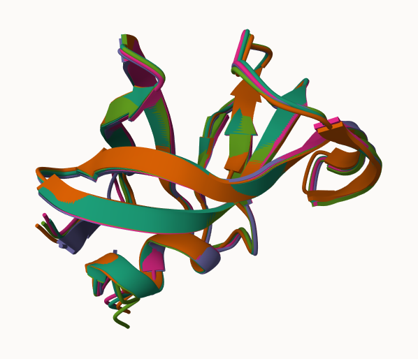
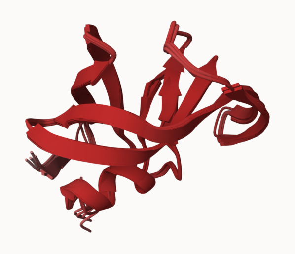

```{r}
library(bio3d)
library(pheatmap)
library(jsonlite)
```

```{r}
## Set Results Directory
results_dir <- "HIVPr_dimer_94b5b/"
```

```{r}
## Read PDB Files
pdb_files <- list.files(
  path = results_dir,
  pattern = "*.pdb",
  full.names = TRUE
)

basename(pdb_files)
```

```{r}
## Align AlphaFold Models
pdbs <- pdbaln(pdb_files, fit=TRUE, exefile="msa")
```
The five AlphaFold models were aligned so their structures could be compared. This makes it easier to see how similar or different the predicted models are from each other.

## Mol* Visualization of Superposed Models



The five AlphaFold models were superposed in Mol* to compare their structural similarity. Most regions overlap closely, indicating that the predicted models are generally consistent with each other.

## Mol* Visualization Colored by pLDDT



The models were colored by pLDDT confidence score using the uncertainty/disorder setting in Mol*. Higher-confidence regions are predicted more reliably, while lower-confidence regions may be more flexible or uncertain.

## Corefit Mol* Visualization


The core-fitted structures highlight the most structurally conserved regions between the models. Variable regions become easier to identify after fitting the stable core residues.

## RMSD Analysis

```{r}
rd <- rmsd(pdbs, fit=TRUE)

range(rd)
```

```{r}
colnames(rd) <- paste0("m",1:5)
rownames(rd) <- paste0("m",1:5)

pheatmap(rd)
```
The RMSD heatmap compares structural similarity between the five AlphaFold models. Lower RMSD values indicate that two models are more structurally similar, while higher values indicate greater structural differences.

## pLDDT Confidence Analysis

```{r}
pdb <- read.pdb("1hsg")

plotb3(pdbs$b[1,], typ="l", lwd=2, sse=pdb)
points(pdbs$b[2,], typ="l", col="red")
points(pdbs$b[3,], typ="l", col="blue")
points(pdbs$b[4,], typ="l", col="darkgreen")
points(pdbs$b[5,], typ="l", col="orange")

abline(v=100, col="gray")
```
The pLDDT plot shows AlphaFold confidence scores across residue positions for each model. Higher scores indicate more reliable predicted structures, while lower scores indicate less confident regions.

## Core Fitting

```{r}
core <- core.find(pdbs)

core.inds <- print(core, vol=0.5)

xyz <- pdbfit(
  pdbs,
  core.inds,
  outpath="corefit_structures"
)
```
Core fitting identifies the most structurally conserved regions shared across the models. These conserved regions are then used to improve structural alignment between predictions.


## RMSF Analysis

```{r}
rf <- rmsf(xyz)

plotb3(rf, sse=pdb)

abline(v=100, col="gray")
```
The RMSF plot shows how much each residue position varies across the five AlphaFold models. Higher RMSF values indicate more flexible or variable regions of the protein.

## PAE Analysis

```{r}
pae_files <- list.files(
  path=results_dir,
  pattern=".*model.*\\.json",
  full.names=TRUE
)

pae1 <- read_json(pae_files[1], simplifyVector=TRUE)

plot.dmat(
  pae1$pae,
  xlab="Residue Position (i)",
  ylab="Residue Position (j)"
)
```
The PAE plot shows AlphaFold confidence in the relative positioning of residues within the structure. Lower PAE values indicate more reliable positioning, while higher values indicate greater uncertainty.


